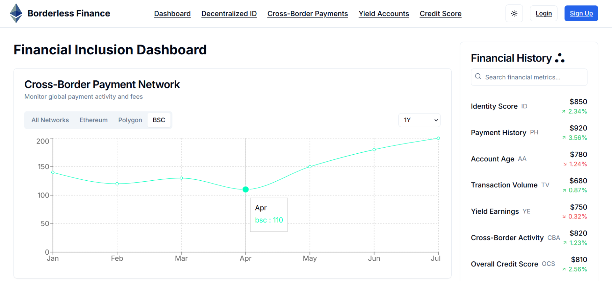
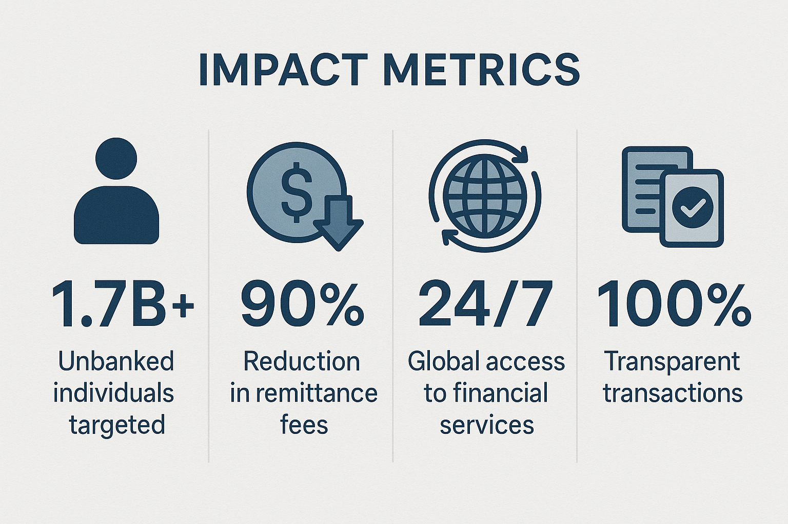

# Borderless Financial Inclusion

[](https://sdgs.un.org/goals/goal10)
[](https://web3.foundation)
[](https://defi.org)
[](LICENSE)
[](https://github.com/yourusername/borderless-financial-inclusion/actions)
[](https://docs.borderless-finance.com)

A decentralized finance (DeFi) platform focused on enabling borderless financial transactions, built with Web3 technologies and aligned with the United Nations' Sustainable Development Goals.



## 🌍 Overview

After months of dedicated development, our team has created a revolutionary decentralized platform that directly addresses SDG 10 (Reduced Inequalities) through innovative blockchain technology. Borderless Finance is transforming the financial landscape by:

- Revolutionizing cross-border remittances with near-zero fees
- Enabling the unbanked to build financial identities
- Providing access to DeFi services for underserved communities

## 🎯 Mission

To empower individuals and communities worldwide with accessible, secure, and efficient financial services through blockchain technology, contributing to the United Nations' Sustainable Development Goals (SDGs), particularly:
- SDG 1: No Poverty
- SDG 8: Decent Work and Economic Growth
- SDG 10: Reduced Inequalities

## ✨ Key Features

### 🆔 Decentralized Identity System
- Creating financial inclusion for the 1.7B unbanked population
- Secure and verifiable digital identities
- Privacy-preserving identity verification

### 💱 Cross-Chain Stablecoin Transfers
- 90% reduction in remittance fees
- Multi-chain interoperability
- Real-time settlement

### 💰 Yield-Generating Wallets
- Turn idle funds into passive income
- Automated yield optimization
- Risk-adjusted investment strategies

### 📊 DeFi Credit Scoring
- Alternative credit assessment
- No traditional banking history required
- Transparent scoring algorithms

### Additional Features
- **Smart Contract Integration**: Secure and transparent financial operations
- **User-Friendly Interface**: Intuitive design for both crypto-natives and newcomers
- **Financial Education**: Resources and tools for financial literacy
- **Community Governance**: Decentralized decision-making processes

## 🛠️ Technology Stack

- **Frontend**: 
  - Next.js 15
  - Three.js
  -Anime.js
  - React 19
  - TailwindCSS
  - Radix UI Components
  - TypeScript

- **Web3 Integration**:
  - Smart Contracts
  - Wallet Integration
  - Blockchain Interoperability

- **Development Tools**:
  - TypeScript
  - PostCSS
  - ESLint
  - Prettier

## 🚀 Getting Started

### Prerequisites

- Node.js (v18 or higher)
- pnpm package manager
- Web3 wallet (MetaMask or similar)

### Installation

1. Clone the repository:
```bash
git clone https://github.com/yourusername/borderless-financial-inclusion.git
cd borderless-financial-inclusion
```

2. Install dependencies:
```bash
pnpm install
```

3. Start the development server:
```bash
pnpm dev
```

4. Open [http://localhost:3000](http://localhost:3000) in your browser.

## 📊 Project Impact



- **1.7B+** Unbanked individuals targeted
- **90%** Reduction in remittance fees
- **24/7** Global access to financial services
- **100%** Transparent transactions

## 📚 Documentation

For detailed documentation, please visit our [Documentation Portal](https://docs.borderless-finance.com).

## 🤝 Contributing

We welcome contributions from the community! Please read our [Contributing Guidelines](CONTRIBUTING.md) for details on our code of conduct and the process for submitting pull requests.

## 📄 License

This project is licensed under the MIT License - see the [LICENSE](LICENSE) file for details.

## Acknowledgments

- United Nations for their Sustainable Development Goals framework
- The Web3 community for their continuous innovation
- All our contributors and supporters

<div align="center">
  <p>Made with ❤️ for a more inclusive financial future</p>
</div> 